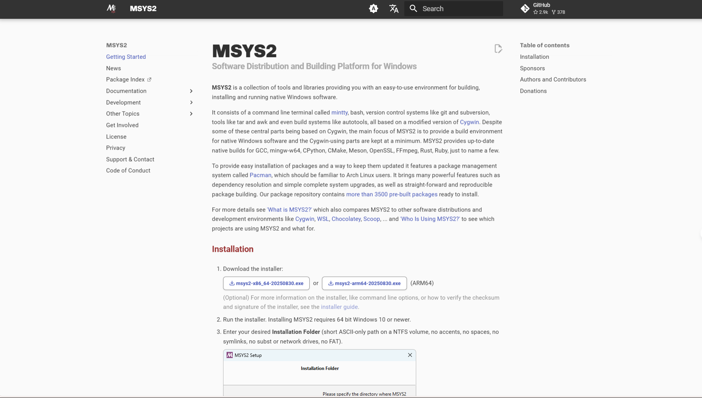

# 1. MSYS2-MINGW 环境配置

## 安装 MSYS2

打开 https://www.msys2.org/
看到 
因为我的是 x86_64 架构的cpu所以点击 
剩下的按照页面中描述的其余步骤下载

## 选择环境并设置环境变量

安装后
找到 你 下载 的 msys2 的路径
我的是 `D:\Software\Dev\msys64`
我们可以看到很多个 MSYS2 版本，分别表示了不同环境的 MSYS2
这里我们选一个 最常用也是我在使用的 ucrt64 作为日后都会使用的版本
然后我们需要打开系统环境变量
将一下环境变量写入你的 PATH 环境变量中 (注意 D:\Software\Dev 是我的路径需要你手动替换)
```
D:\Software\Dev\msys64\ucrt64\bin
D:\Software\Dev\msys64\ucrt64\include
D:\Software\Dev\msys64\ucrt64\lib
```

## 设置镜像（可选，使用魔法的可跳过）

回到 你 下载 的 msys2 的路径
打开 etc 目录下的 pacman.d 目录
我们看到这些文件
```
msys64/
└── etc/
    └── pacman.d/
        ├── mirrorlist.clang64
        ├── mirrorlist.mingw
        ├── mirrorlist.mingw32
        ├── mirrorlist.mingw64
        ├── mirrorlist.msys
        └── mirrorlist.ucrt64

```
mirrorlist 的 不同后缀代表了 不同环境的 msys2 包管理（pacman）使用的镜像源
打开 前面选的环境的 mirrorlist （这里我们以mirrorlist.ucrt64 为例）,但是最好配了一个就将 mingw32，mingw64，msys这几个版本都配一下以防万一
> 由于部分windows电脑可能会将他们的权限设置不可写的情况，需要先右键 要修改的文件 点击 【属性】后打开【安全】后点击【编辑】后点击【添加】后点击【高级】后点击【立即查找】在搜索结果中点击
>【EveryOne】后点击【确定】后回到上一级点【确定】后回到上一级将【完全控制】勾选后点击【确定】后回到上一级点【确定】就可进行修改

- 以`mirrorlist.ucrt64`为例
在最上方写入
```
## China - USTC
Server = https://mirrors.ustc.edu.cn/msys2/mingw/ucrt64/

## China - Tsinghua
Server = https://mirrors.tuna.tsinghua.edu.cn/msys2/mingw/ucrt64/

## China - BFSU
Server = https://mirrors.bfsu.edu.cn/msys2/mingw/ucrt64

## China - Aliyun
Server = https://mirrors.aliyun.com/msys2/ucrt64
```
- 对`mirrorlist.mingw32`的补充
```
## China - USTC
Server = https://mirrors.ustc.edu.cn/msys2/mingw/mingw32/

## China - Tsinghua
Server = https://mirrors.tuna.tsinghua.edu.cn/msys2/mingw/mingw32/

## China - BFSU
Server = https://mirrors.bfsu.edu.cn/msys2/mingw/mingw/mingw32/

## China - Aliyun
Server = https://mirrors.aliyun.com/msys2/mingw/mingw32/
```
- 对`mirrorlist.mingw64`的补充
```
## China - USTC
Server = https://mirrors.ustc.edu.cn/msys2/mingw/mingw64/

## China - Tsinghua
Server = https://mirrors.tuna.tsinghua.edu.cn/msys2/mingw/mingw64/

## China - BFSU
Server = https://mirrors.bfsu.edu.cn/msys2/mingw/mingw/mingw64/

## China - Aliyun
Server = https://mirrors.aliyun.com/msys2/mingw/mingw64/
```
- 对`mirrorlist.msys`的补充
```
## China - USTC
Server = https://mirrors.ustc.edu.cn/msys2/msys/$arch/

## China - Tsinghua
Server = https://mirrors.tuna.tsinghua.edu.cn/msys2/msys/$arch/

## China - BFSU
Server = https://mirrors.bfsu.edu.cn/msys2/mingw/msys/$arch/

## China - Aliyun
Server = https://mirrors.aliyun.com/msys2/msys/$arch/
```
安装后进入 任意一个 msys 环境运行以下命令 进行同步更新仓库
```bash
pacman -Syyu
```


## 安装 基础 C/C++ 的开发套件

- gcc
```
pacman -S mingw-w64-ucrt-x86_64-gcc
```
- make
```
pacman -S mingw-w64-ucrt-x86_64-make
```
- cmake
```
pacman -S mingw-w64-ucrt-x86_64-cmake
```
- meson
```
pacman -S mingw-w64-ucrt-x86_64-meson
```
- ninja
```
pacman -S mingw-w64-ucrt-x86_64-ninja
```
- pkg-config (用于对下载的库生成 cFlag 等编译参数的软件)
```
pacman -S pkg-config
```
