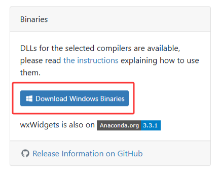
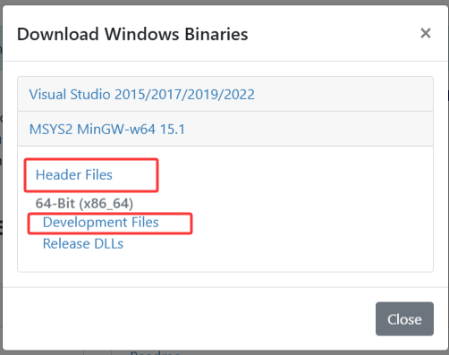

# 4. 使用 wxWidgets

在 项目中 使用 wxWidgets 用两种方式

## 通过 msys2 的 pacman 安装
```bash
pacman -S mingw-w64-ucrt-x86_64-wxWidgets

# 不过在大部分 镜像中貌似都没有收录 直接以 wxWidgets 为包名收录
# 需要指定版本 这里 3.3 指的是 3.3 版本
# 在 windows 自动安装为 ingw-w64-ucrt-x86_64-wxWidgets3.3-msw
pacman -S mingw-w64-ucrt-x86_64-wxWidgets3.3
# 另外还可以安装
pacman -S mingw-w64-ucrt-x86_64-wxWidgets3.3-common-libs
```
在 cmake
```cmake
cmake_minimum_required(VERSION 3.16)
project(MyApp LANGUAGES CXX)

# 查找 wxWidgets
find_package(wxWidgets REQUIRED COMPONENTS core base)

# 包含头文件
include(${wxWidgets_USE_FILE})

# 创建可执行文件
add_executable(${PROJECT_NAME} src/main.cpp src/MyFrame.cpp)

# 链接 wxWidgets
target_link_libraries(${PROJECT_NAME} PRIVATE ${wxWidgets_LIBRARIES})
target_include_directories(${PROJECT_NAME} PRIVATE ${wxWidgets_INCLUDE_DIRS})
```
在 meson
```meson
project('MyApp', 'cpp',
    version: '0.1',
    default_options: ['cpp_std=c++17']
)

inc = include_directories('include')
src = ['src/main.cpp', 'src/MyFrame.cpp']

wx = dependency('wx', modules: ['core', 'base'], required: true)

exe = executable('MyApp',
    src,
    include_directories: inc,
    dependencies: [wx]
)

```  

## 通过 官方 下载 安装
官方下载地址：https://wxwidgets.org/downloads/
点击 
选择 MSYS2 MinGW-w64 15.1
下载 `Header Files` 与 `Develoment Files`

下载好后解压 `Header Files` 到 C:\wxwidgets 
解压 `Develoment Files` 到 C:\wxwidgets 中
在 C:\wxwidgets 中 创建一个 bin 文件夹
打开 C:\wxwidgets\lib\gcc1510_x64_dll
将里面 的 所有 dll 移动到 C:\wxwidgets\bin 中
其余文件 移动到 C:\wxwidgets\lib 中
回到 C:\wxwidgets\lib 中 删除 gcc1510_x64_dll 这个空文件
这样我们就有了这么一个结构
```
├─bin
│   ├─wxbase331u_gcc1510_x64.dll
│   ├─wxbase331u_net_gcc1510_x64.dll
│   ├─wxbase331u_xml_gcc1510_x64.dll
│   ├─wxmsw331u_adv_gcc1510_x64.dll
│   ├─wxmsw331u_aui_gcc1510_x64.dll
│   ├─wxmsw331u_core_gcc1510_x64.dll
│   ├─wxmsw331u_gl_gcc1510_x64.dll
│   ├─wxmsw331u_html_gcc1510_x64.dll
│   ├─wxmsw331u_media_gcc1510_x64.dll
│   ├─wxmsw331u_propgrid_gcc1510_x64.dll
│   ├─wxmsw331u_ribbon_gcc1510_x64.dll
│   ├─wxmsw331u_richtext_gcc1510_x64.dll
│   ├─wxmsw331u_stc_gcc1510_x64.dll
│   ├─wxmsw331u_webview_gcc1510_x64.dll
│   ├─wxmsw331u_xrc_gcc1510_x64.dll
├─include
│   ├─msvc
│   │   ├─wx
│   ├─wx
│   │   ├─android
│   │   ├─aui
│   │   ├─dfb
│   │   ├─generic
│   │   ├─gtk
│   │   ├─html
│   │   ├─meta
│   │   ├─msw
│   │   ├─osx
│   │   ├─persist
│   │   ├─private
│   │   ├─propgrid
│   │   ├─protocol
│   │   ├─qt
│   │   ├─ribbon
│   │   ├─richtext
│   │   ├─stc
│   │   ├─univ
│   │   ├─unix
│   │   ├─x11
│   │   ├─xml
│   │   ├─xrc
│   │   ├─aboutdlg.h
│   │   ├─accel.h
│   │   ├─access.h
│   │   ├─activityindicator.h
│   │   ├─addremovectrl.h
│   │   ├─affinematrix2d.h
│   │   ├─affinematrix2dbase.h
│   │   ├─afterstd.h
│   │   ├─anidecod.h
│   │   ├─animate.h
│   │   ├─animdecod.h
│   │   ├─any.h
│   │   ├─anybutton.h
│   │   ├─anystr.h
│   │   ├─app.h
│   │   ├─ # 其余 头文件
├─lib
│   ├─mswu
│   │   ├─wx
│   │   ├─build.cfg
│   ├─mswud
│   │   ├─wx
│   │   ├─build.cfg
│   ├─libwxbase33u.a
│   ├─libwxbase33ud.a
│   ├─libwxbase33ud_net.a
│   ├─libwxbase33ud_xml.a
│   ├─libwxbase33u_net.a
│   ├─libwxbase33u_xml.a
│   ├─libwxexpat.a
│   ├─libwxexpatd.a
│   ├─libwxjpeg.a
│   ├─libwxjpegd.a
│   ├─libwxlexilla.a
│   ├─libwxlexillad.a
│   ├─libwxmsw33ud_adv.a
│   ├─libwxmsw33ud_aui.a
│   ├─libwxmsw33ud_core.a
│   ├─libwxmsw33ud_gl.a
│   ├─libwxmsw33ud_html.a
│   ├─libwxmsw33ud_media.a
│   ├─libwxmsw33ud_propgrid.a
│   ├─libwxmsw33ud_ribbon.a
│   ├─libwxmsw33ud_richtext.a
│   ├─libwxmsw33ud_stc.a
│   ├─libwxmsw33ud_webview.a
│   ├─libwxmsw33ud_xrc.a
│   ├─libwxmsw33u_adv.a
│   ├─libwxmsw33u_aui.a
│   ├─libwxmsw33u_core.a
│   ├─libwxmsw33u_gl.a
│   ├─libwxmsw33u_html.a
│   ├─libwxmsw33u_media.a
│   ├─libwxmsw33u_propgrid.a
│   ├─libwxmsw33u_ribbon.a
│   ├─libwxmsw33u_richtext.a
│   ├─libwxmsw33u_stc.a
│   ├─libwxmsw33u_webview.a
│   ├─libwxmsw33u_xrc.a
│   ├─libwxpng.a
│   ├─libwxpngd.a
│   ├─libwxregexu.a
│   ├─libwxregexud.a
│   ├─libwxscintilla.a
│   ├─libwxscintillad.a
│   ├─libwxtiff.a
│   ├─libwxtiffd.a
│   ├─libwxwebp.a
│   ├─libwxwebpd.a
│   ├─libwxzlib.a
│   ├─libwxzlibd.a

```
我们将bin目录写入系统 PATH 环境变量中
编写一个 名为 WXWIN 的 环境变量，值为 C:\wxwidgets

在 cmake
```cmake
cmake_minimum_required(VERSION 3.16)
project(MyApp LANGUAGES CXX)

set(CMAKE_CXX_STANDARD 17)
set(CMAKE_CXX_STANDARD_REQUIRED ON)

# 可选：允许用 WXWIN 环境变量或 -DwxWidgets_ROOT_DIR 指定路径
if(NOT DEFINED wxWidgets_ROOT_DIR AND DEFINED ENV{WXWIN})
  set(wxWidgets_ROOT_DIR $ENV{WXWIN})
endif()

# 简单查找（适用于绝大多数 wxWidgets 安装）
find_package(wxWidgets REQUIRED COMPONENTS core base)
include(${wxWidgets_USE_FILE})

add_executable(${PROJECT_NAME} src/main.cpp src/MyFrame.cpp)

target_include_directories(${PROJECT_NAME} PRIVATE ${wxWidgets_INCLUDE_DIRS})
target_link_libraries(${PROJECT_NAME} PRIVATE ${wxWidgets_LIBRARIES})
target_compile_definitions(${PROJECT_NAME} PRIVATE ${wxWidgets_DEFINITIONS})
```

在 meson
```meson
project('MyApp', 'cpp', default_options: ['cpp_std=c++17'])

src = ['src/main.cpp', 'src/MyFrame.cpp']

# 先试 pkg-config / wrap（如果可用）
wx_dep = dependency('wx', required: false)

if wx_dep.found()
  exe = executable('MyApp', src, dependencies: [wx_dep])
else
  # 回退：用 WXWIN 环境变量或默认路径，手动指定 include 和库
  wx_root = getenv('WXWIN')
  if not wx_root
    wx_root = 'C:/wxwidgets'
  endif

  wx_inc = include_directories(wx_root + '/include')
  wx_lib_dir = wx_root + '/lib'

  cc = meson.get_compiler('cpp')
  # 根据你的 lib 目录实际名称调整库名（这里是常见 3.3.x 名称）
  wx_core = cc.find_library('wxmsw33u_core', dirs: [wx_lib_dir], required: true)
  wx_base = cc.find_library('wxbase33u', dirs: [wx_lib_dir], required: true)

  exe = executable('MyApp', src,
    include_directories: [wx_inc],
    link_with: [wx_core, wx_base]
  )
endif
```